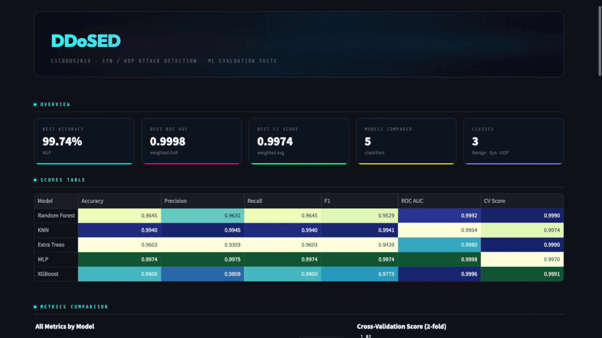
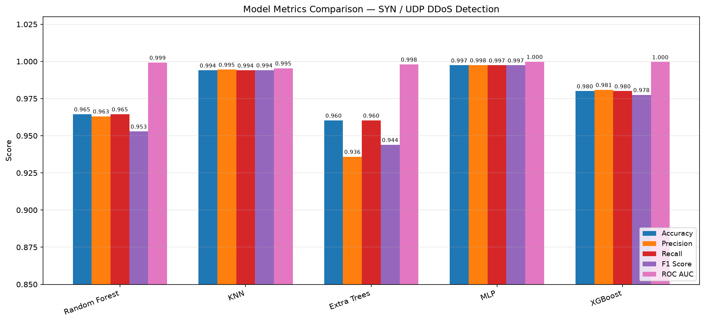
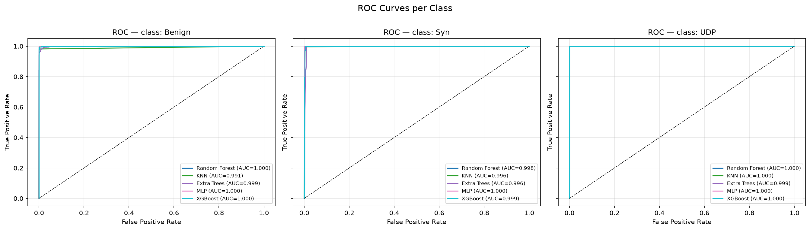
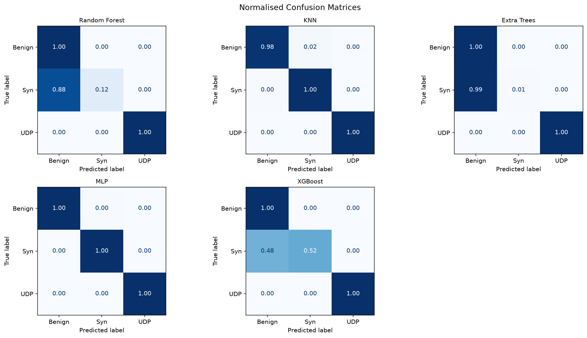
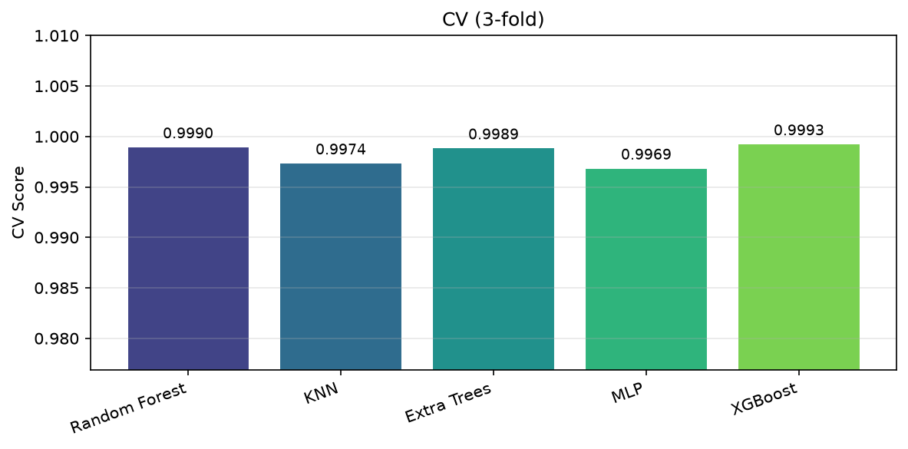
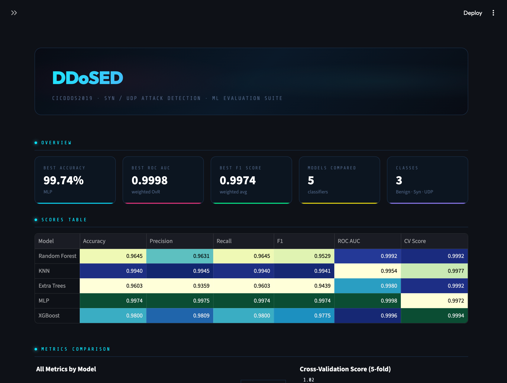
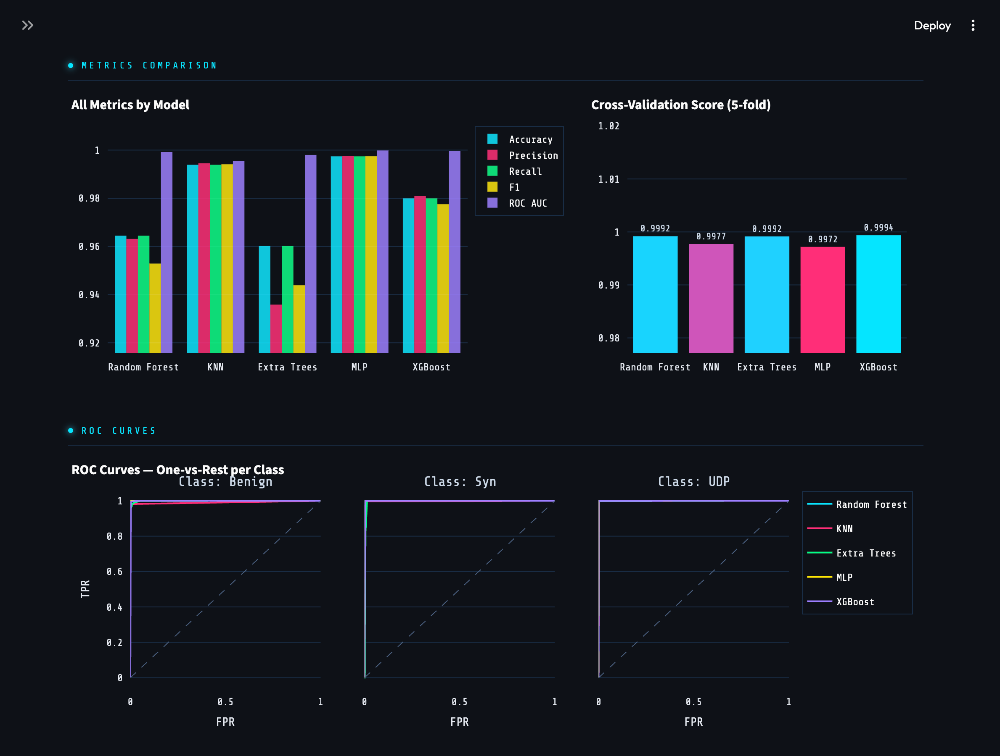
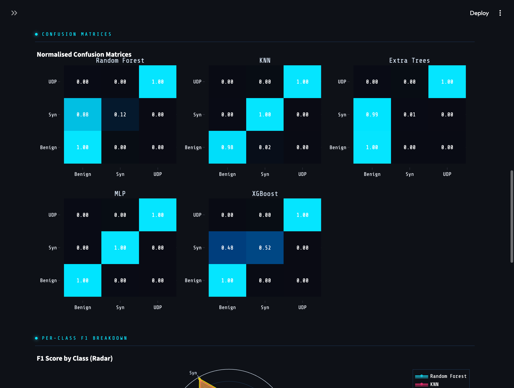
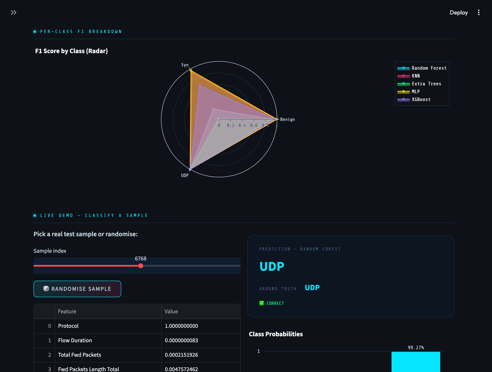

# DDoSED

**DDoS Educational Detector** - a lightweight machine learning pipeline and interactive dashboard for classifying SYN flood and UDP flood DDoS traffic against benign network flows.

[Python 3.13](https://www.python.org/downloads/)
[Dataset: CICDDoS2019](https://www.kaggle.com/datasets/dhoogla/cicddos2019)

> **Disclaimer:** This is an **educational, offline research tool** for a university cybersecurity course. It is **not** a production intrusion detection system and does not capture live network traffic or perform real mitigation.

---

## Summary

DDoSED trains and compares five lightweight classifiers on flow-level features from the [CICDDoS2019](https://www.kaggle.com/datasets/dhoogla/cicddos2019) dataset. Traffic is classified into three labels:


| Class      | Description    |
| ---------- | -------------- |
| **Benign** | Normal traffic |
| **Syn**    | SYN flood DDoS |
| **UDP**    | UDP flood DDoS |


The project includes an offline evaluation pipeline that writes metrics and plots to `reports/`, and a Streamlit dashboard for interactive model comparison and sample-level classification.



---

## Dataset

We use the **CICDDoS2019** dataset ([Kaggle: dhoogla/cicddos2019](https://www.kaggle.com/datasets/dhoogla/cicddos2019)), bundled in the repository as `data/cicddos2019-dataset.zip`.

Four parquet files are loaded, preserving the dataset's native train/test split:


| File                   | Split |
| ---------------------- | ----- |
| `Syn-training.parquet` | Train |
| `Syn-testing.parquet`  | Test  |
| `UDP-training.parquet` | Train |
| `UDP-testing.parquet`  | Test  |


### Label normalization

The Kaggle distribution uses inconsistent label strings across train and test files. We normalize them before training:


| Raw label                               | Normalized |
| --------------------------------------- | ---------- |
| `DrDoS_Syn`, `Syn`                      | `Syn`      |
| `DrDoS_UDP`, `UDP-lag`, `UDPLag`, `UDP` | `UDP`      |
| `BENIGN`, `Benign`                      | `Benign`   |


After preprocessing (constant-column removal, correlation filtering, deduplication), the pipeline yields **30 features**, **84,644 training rows**, and **13,069 test rows**:


| Class  | Train  | Test   |
| ------ | ------ | ------ |
| Benign | 29,665 | 2,402  |
| Syn    | 40,654 | 501    |
| UDP    | 14,325 | 10,166 |


The test set is imbalanced toward UDP flows; per-class metrics in the classification reports should be read alongside overall accuracy.

---

## Pipeline

Processing is implemented in `src/preprocess.py` and `src/evaluation.py`.

1. **Load** - read the four parquet files from the zip archive and concatenate train/test frames.
2. **Normalize labels** - apply the mapping above; keep only `Benign`, `Syn`, and `UDP`.
3. **Clean features** - drop columns with a single unique value; drop pairs with Pearson correlation > 0.8; remove duplicate rows.
4. **Encode** - `LabelEncoder` for targets; `MinMaxScaler` fit on train, applied to test.
5. **Train & evaluate** - fit all five classifiers on the training set; score on the held-out test set.
6. **Report** - write metrics, classification reports, and plots to `reports/` (generated locally, gitignored).

Entry point for the full offline run: `src/main.py` (3-fold cross-validation on the training set). Running `src/evaluation.py` directly uses 5-fold CV instead.

---

## Models

Five scikit-learn / XGBoost classifiers are trained and compared:


| Model         | Implementation                                         |
| ------------- | ------------------------------------------------------ |
| Random Forest | `RandomForestClassifier` (100 estimators)              |
| KNN           | `KNeighborsClassifier` (k = 10)                        |
| Extra Trees   | `ExtraTreesClassifier` (100 estimators)                |
| MLP           | `MLPClassifier` (100 hidden units, 500 max iterations) |
| XGBoost       | `XGBClassifier` (100 estimators)                       |


### Metrics

For each model we report:

- **Accuracy**
- **Weighted** precision, recall, and F1 score
- **ROC AUC** (one-vs-rest for multiclass)
- **Cross-validation** score on the training set

---

## Results & Reports

Running the evaluation pipeline produces the following artifacts under `reports/`:


| Output                       | Description                            |
| ---------------------------- | -------------------------------------- |
| `scores_summary.csv`         | Metric table for all models            |
| `classification_reports.txt` | Per-model precision/recall/F1 by class |
| `metrics_comparison.png`     | Bar chart of all metrics               |
| `roc_curves.png`             | ROC curves per class                   |
| `confusion_matrices.png`     | Normalised confusion matrices          |
| `cv_scores.png`              | Cross-validation scores                |


### Measured results

Metrics below were produced by `uv run python src/main.py` on the held-out test set (3-fold CV on train).


| Model         | Accuracy   | Precision (w) | Recall (w) | F1 (w)     | ROC AUC    | CV (3-fold) |
| ------------- | ---------- | ------------- | ---------- | ---------- | ---------- | ----------- |
| Random Forest | 0.9645     | 0.9631        | 0.9645     | 0.9529     | 0.9992     | 0.9990      |
| KNN           | 0.9940     | 0.9945        | 0.9940     | 0.9941     | 0.9954     | 0.9974      |
| Extra Trees   | 0.9603     | 0.9359        | 0.9603     | 0.9439     | 0.9980     | 0.9989      |
| **MLP**       | **0.9974** | **0.9975**    | **0.9974** | **0.9974** | **0.9998** | 0.9969      |
| XGBoost       | 0.9800     | 0.9809        | 0.9800     | 0.9775     | 0.9996     | 0.9993      |


**MLP** achieved the highest test accuracy and weighted F1. On the test set, MLP per-class F1 was Benign 0.9965, Syn 0.9728, UDP 0.9989 (see `reports/classification_reports.txt`). Extra Trees and Random Forest showed weak Syn recall (0.006 and 0.116 respectively), illustrating that high overall accuracy can mask poor minority-class detection.

### Screenshots

Offline report plots (from `reports/`):


| Metrics comparison                                                               | ROC curves                                                        |
| -------------------------------------------------------------------------------- | ----------------------------------------------------------------- |
|                    |                     |


| Confusion matrices                                                               | CV scores                                                         |
| -------------------------------------------------------------------------------- | ----------------------------------------------------------------- |
|                    |                       |

---

## Dashboard

The Streamlit app (`src/dashboard.py`) provides:

- **Model comparison** - scores table, grouped metrics bar chart, cross-validation chart
- **Interactive charts** - ROC curves (one-vs-rest per class), normalised confusion matrices, per-class F1 radar
- **Live classification** - select or randomise a test sample; view scaled feature values, predicted class vs ground truth, and class probability bars
- **Sidebar controls** - cross-validation fold count, model multiselect, demo classifier selection

If the dataset zip is missing or fails to load, the dashboard falls back to synthetic demo data and displays a warning.

```bash
uv run streamlit run src/dashboard.py
```






---

## Installation & Reproduction

### Prerequisites

- [Python 3.13](https://www.python.org/downloads/)
- [uv](https://docs.astral.sh/uv/) package manager

### Steps

```bash
# 1. Clone the repository
git clone https://github.com/LilConsul/DDoSED.git
cd DDoSED

# 2. Install dependencies
uv sync

# 3. Run offline evaluation (writes to reports/)
uv run python src/main.py

# 4. Launch the interactive dashboard
uv run streamlit run src/dashboard.py
```

The dataset is already included in `data/cicddos2019-dataset.zip` - no separate download is required for a standard checkout. The `reports/` directory is created at runtime and is not tracked by git.

### Additional commands

```bash
# Verify dataset loading and label distributions
uv run python src/load_dataset.py

# Run evaluation directly (5-fold cross-validation)
uv run python src/evaluation.py

# Install development tools (ruff, pre-commit)
uv sync --extra dev
```

---

## Project Structure

```
DDoSED/
├── data/
│   └── cicddos2019-dataset.zip   # CICDDoS2019 SYN/UDP parquet files
├── src/
│   ├── paths.py                  # Project paths (data, reports)
│   ├── load_dataset.py           # Dataset download and loading
│   ├── preprocess.py             # Preprocessing pipeline
│   ├── evaluation.py             # Model training, metrics, plots
│   ├── main.py                   # Offline evaluation entry point
│   └── dashboard.py              # Streamlit dashboard
├── docs/
├── reports/                      # Generated at runtime (gitignored)
├── pyproject.toml                # Dependencies and metadata
├── PICKME.md                     # Team ASCII art
└── README.md
```

---

## Team


| Name             |
| ---------------- |
| Yehor Karabanov  |
| Denys Shevchenko |
| Ihor Tymkiv      |


See also [PICKME.md](PICKME.md) for the team's cool ASCII banner.

---

## License

This repository is provided for educational purposes as part of a university coursework project. The [CICDDoS2019](https://www.kaggle.com/datasets/dhoogla/cicddos2019) dataset is subject to its own terms on Kaggle; cite the original dataset if you use or redistribute results derived from it.

---

DDoSED · CICDDoS2019 · SYN / UDP Classification · Educational use only